<h1 align="center">ImmaSpark</h1>

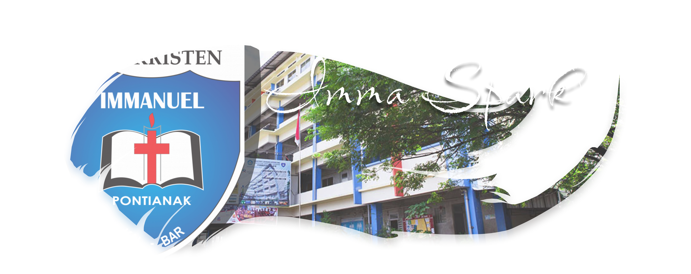
 

   
    
   
    
   

## Table of Contents

   
Tekan untuk Buka

- [Instalasi](#instalasi)
- [Penggunaan](#penggunaan)
- [Fitur Utama](#fitur-utama)
- [Entitas](#entitas)
- [Arsitektur](#arsitektur)
- [Kontributor](#kontributor)
- [Lisensi](#lisensi)
- [Changelog](#changelog)
- [Link](#link)

## Instalasi

   
Instalasi

### Step 1

   
Pilih Versi
 

   

      
Unstable Version

1. Download repository ini (Cari tombol code warna hijau di bagian atas terus tekan "Download ZIP").
      

         
Step 1A-1

         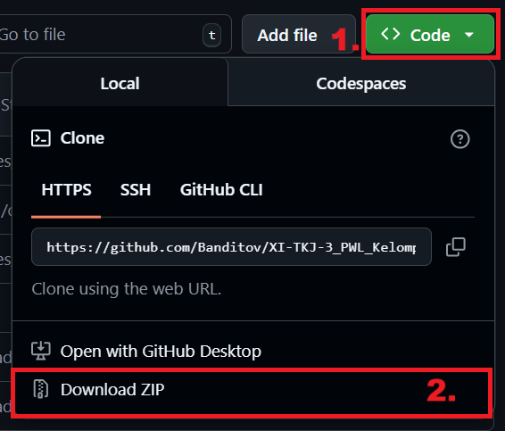
      

2. Ekstrak file tersebut.
      

         
Step 1A-2

         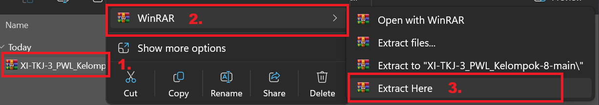
      

3. Pindahkan folder yang telah diekstrak ke directory "C:\laragon\www\". Folder yang dipindahkan seharusnya dapat langsung melihat isi dari websitenya, apabila dalam folder yang dipindahkan terdapat sebuah folder lagi, keluarkan semua isi dari websitenya keluar dari foldernya.
      

         
Step 1A-3

         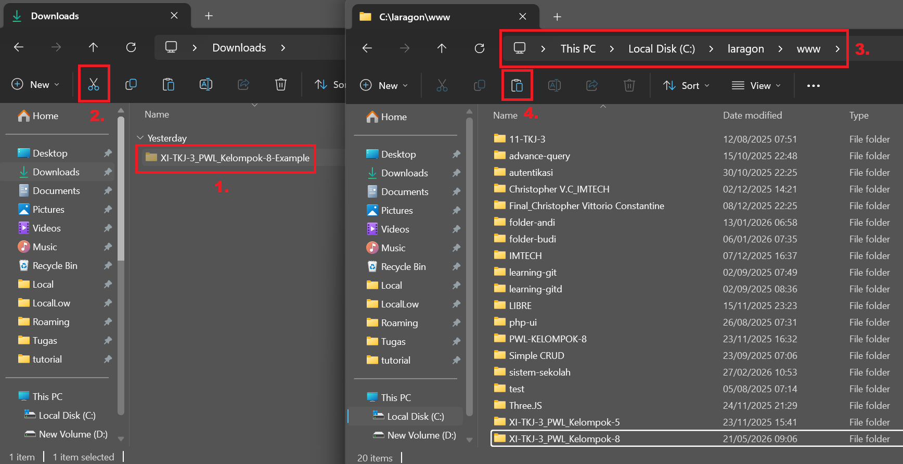
      

4. Buka Laragon.
      

         
Step 1A-4

         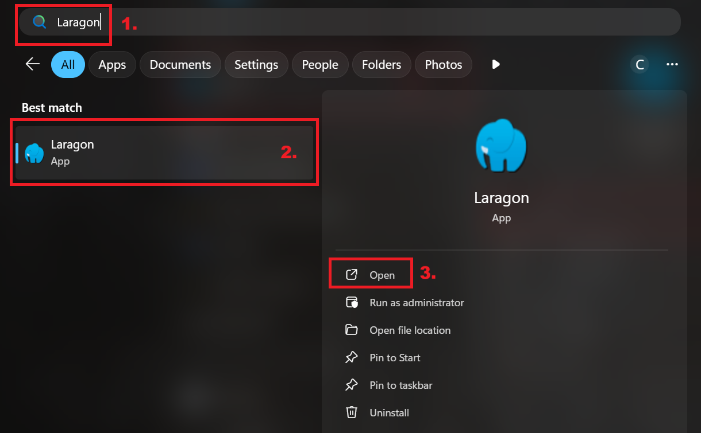
      

5. Tekan "Start All" dan tekan "Database".
      

         
Step 1A-5

         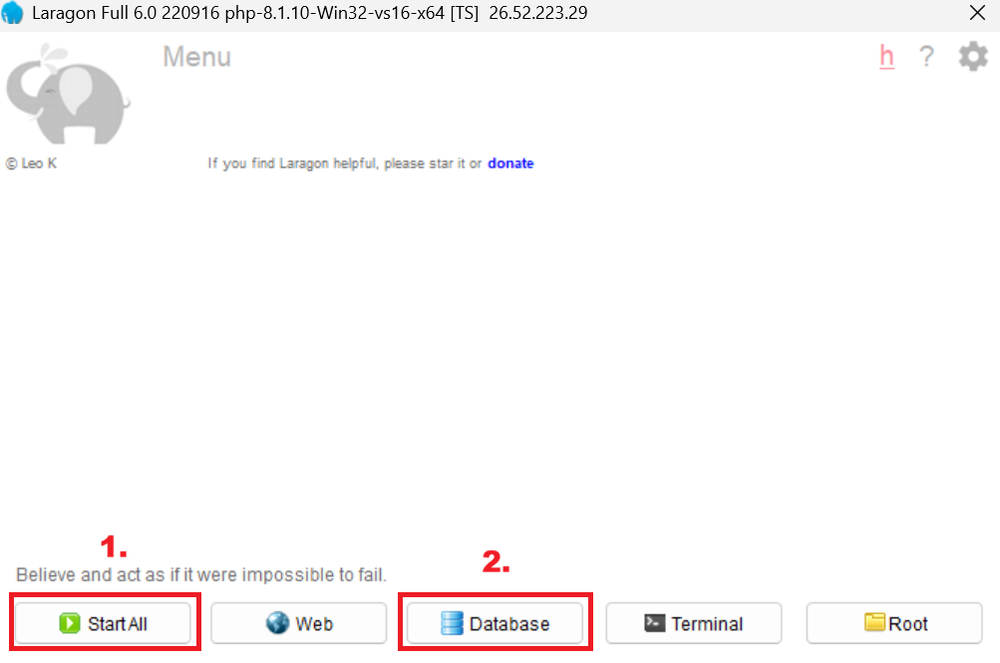
      

6. Login ke phpMyAdmin menggunakan username "root" dan password kosong.
      

         
Step 1A-6

         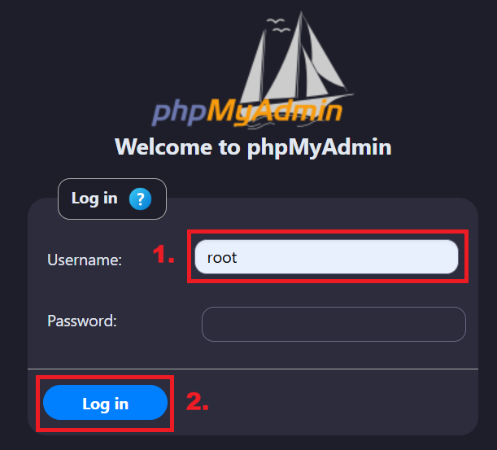
      

7. Buat database dengan nama "immaspark".
      

         
Step 1A-7

         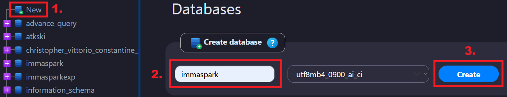
      

8. Import file "immaspark.sql" yang terdapat di dalam folder yang telah dipindahkan.
      

         
Step 1A-8

         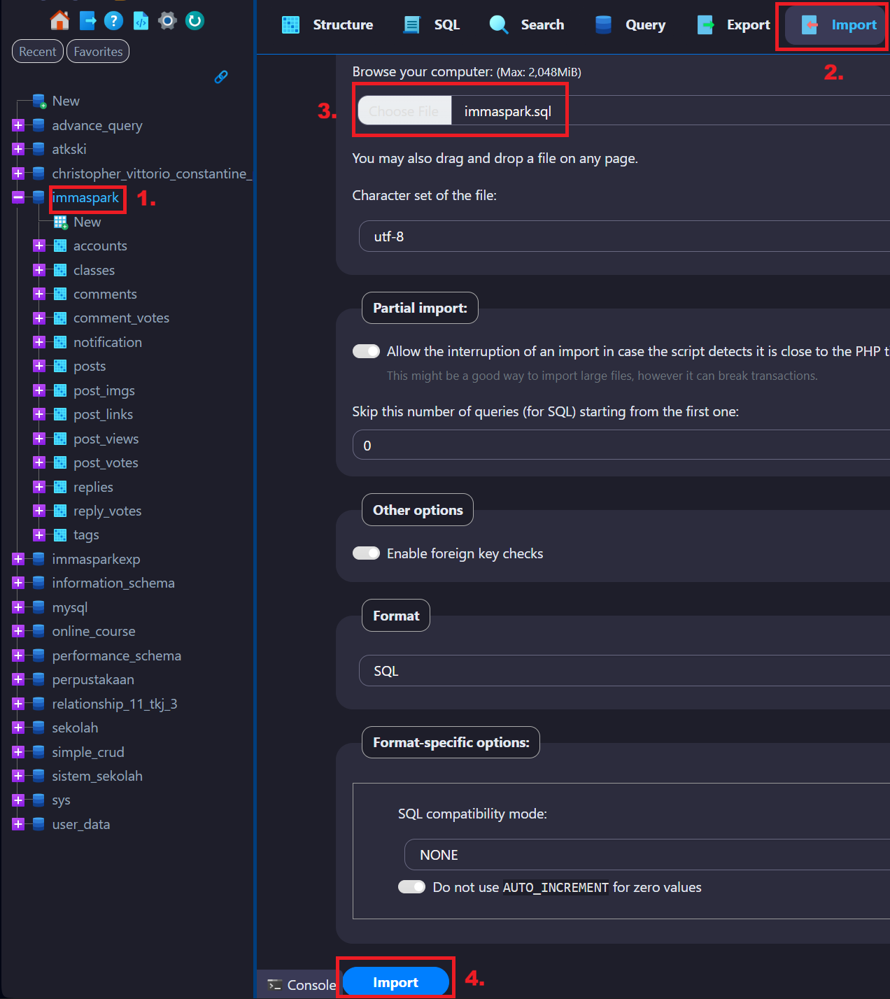
      

9. Lanjut ke Step 2.
   

 
   

      
Stable Version

1. Buka page <a href="https://github.com/Banditov/XI-TKJ-3_PWL_Kelompok-8/releases">Releases</a> dari repository ini.
      

         
Step 1B-1

         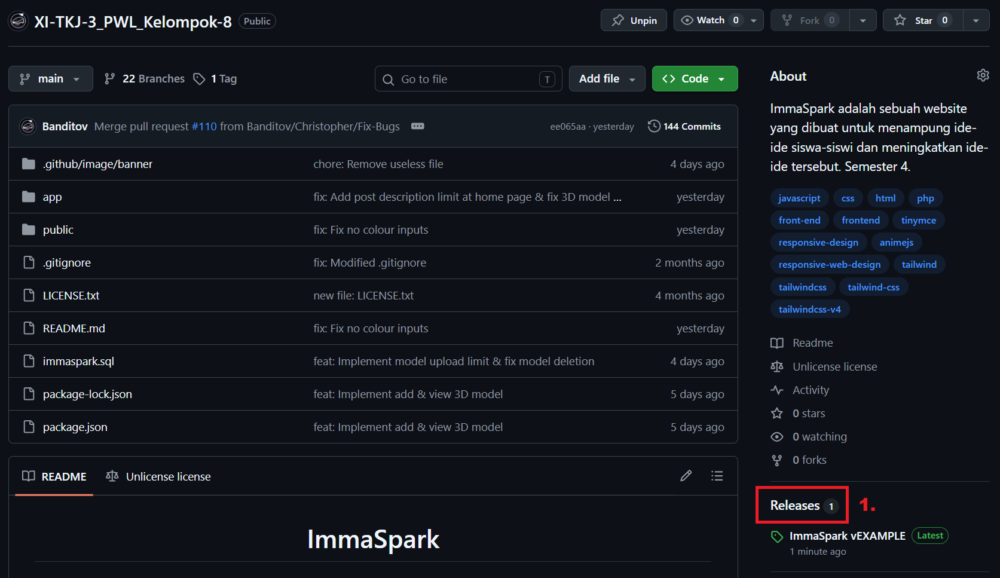
      

2. Pilih salah satu release, tekan "Assets", dan tekan "Source code (zip)".
      

         
Step 1B-2

         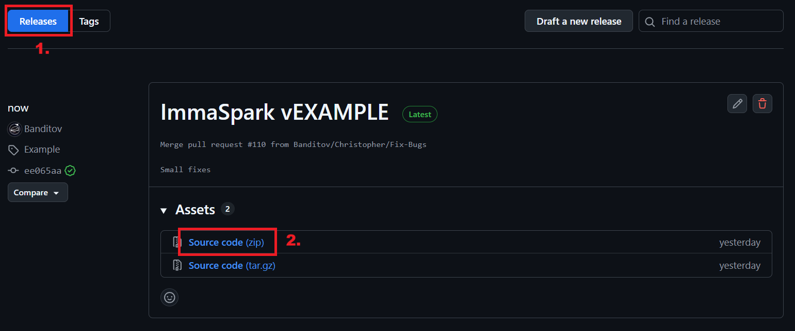
      

3. Ekstrak file tersebut.
      

         
Step 1B-3

         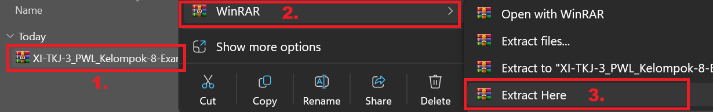
      

4. Pindahkan folder yang telah diekstrak ke directory "C:\laragon\www\". Folder yang dipindahkan seharusnya dapat langsung melihat isi dari websitenya, apabila dalam folder yang dipindahkan terdapat sebuah folder lagi, keluarkan semua isi dari websitenya keluar dari foldernya.
      

         
Step 1B-4

         
      

5. Buka Laragon.
      

         
Step 1B-5

         
      

6. Tekan "Start All" dan tekan "Database".
      

         
Step 1B-6

         
      

7. Login ke phpMyAdmin menggunakan username "root" dan password kosong.
      

         
Step 1B-7

         
      

8. Buat database dengan nama "immaspark".
      

         
Step 1B-8

         
      

9. Import file "immaspark.sql" yang terdapat di dalam folder yang telah dipindahkan.
      

         
Step 1B-9

         
      

10. Lanjut ke Step 2.
   

### Step 2

   
Step 2

1. Buka terminal di Laragon.
      

         
Step 2-1

         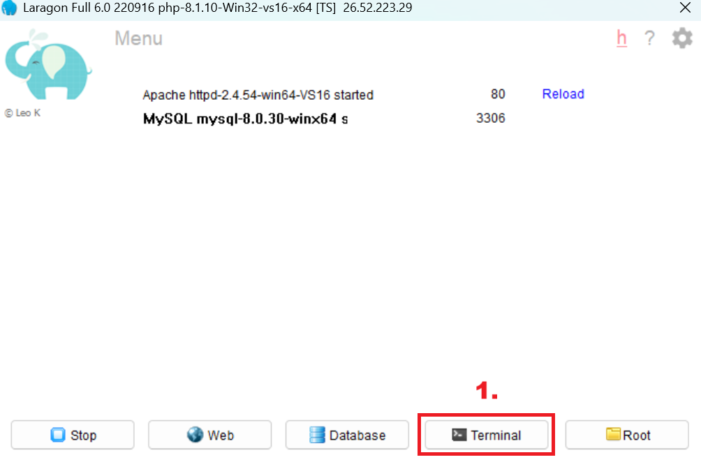
      

2. Ketikkan "cd (Nama folder yang diekstrak tadi)". Apabila lupa, ketikkan "ls" dan cari nama folder yang sesuai.
      

         
Step 2-2

         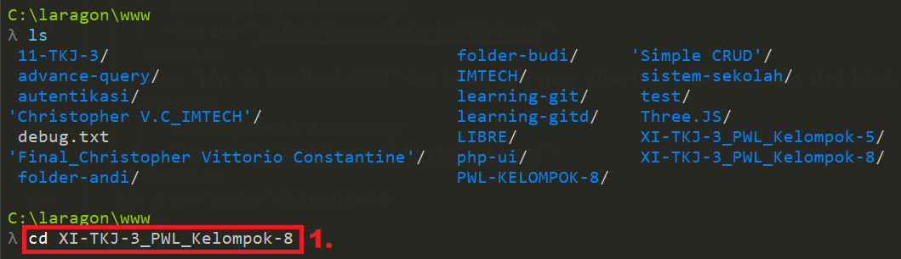
      

3. Ketikkan "php -S localhost:5500 -t public" dan tekan link yang diberikan sambil menekan ctrl kiri.
      

         
Step 2-3

         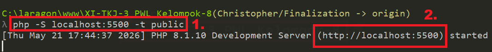
      

   <h3 align="center">Selesai!</h3>

 

   
Hosted

<a href="http://immaspark.page.gd">Tekan aku!</a> 

## Penggunaan
ImmaSpark adalah sebuah website tempat siswa bisa menyimpan, membagikan, dan mengembangkan ide-ide kreatif mereka supaya tidak mudah lupa atau hilang begitu saja. Di website ini, siswa dapat membuat postingan ide, berdiskusi lewat komentar, serta memberi vote pada ide siswa lain. Jumlah vote yang didapat akan menunjukkan perkembangan dan ketertarikan pengguna terhadap ide tersebut, sehingga ide-ide yang menarik bisa lebih mudah berkembang dan dikenal banyak orang. Dengan adanya ImmaSpark, siswa memiliki wadah untuk lebih bebas berkreasi, berbagi pendapat, dan saling mendukung dalam mengembangkan ide baru.

## Fitur Utama

   
Berikut ini adalah fitur-fitur utama yang terdapat pada setiap page pada website ImmaSpark:

- Login

   Halaman digunakan untuk login ke dalam akun dan masuk ke dalam halaman utama.

- Voting

   Pengguna dapat menekan tombol panah ke atas atau ke bawah untuk menambah/mengurangi vote sebuah post.
  
- Explore

   Pengguna dapat menggunakan halaman ini untuk mencari berbagai postingan ide yang telah dibuat pada website ini. Pengguna dapat menemukan settings dan filter pada bagian navbar kiri. Peletakan post-post pada halaman ini dibuat random.

- Latest

   Memiliki fungsi yang sama dengan halaman explore. Perbedaannya adalah peletakan post-postnya dimulai dari tanggal terbaru.
  
- Pinned

   Halaman ini hanya menampilkan post-post yang telah dipin oleh admin.
  
- Popular

   Memiliki fungsi yang sama dengan halaman explore. Perbedaannya adalah peletakan post-postnya dimulai dari views terbanyak.

- Class Agenda

  Pengguna yang berstatus sebagai pelajar dapat melihat dan membuat tugas untuk kelas mereka. Apabila pengguna adalah admin, maka pengguna dapat melihat dan menambahkan tugas pada semua kelas.
  
- My Posts

   Halaman ini hanya menampilkan post-post yang telah dibuat oleh pengguna.
  
- Notifications

   Halaman ini menampilkan notifikasi ketika seorang pengguna lain komentar/reply pada post/komen pengguna.
  
- Post Details

   Pada post details, pengguna dapat melihat semua isi dari deskripsi dan komen pada post tersebut.
  
- Create Post

   Memiliki fungsi untuk membuat sebuah post. Post dapat menampung: title, deskripsi, image, link, model 3D, dan tags.

- Edit Post

   Pemilik dari sebuah post dapat menekan tombol edit pada post mereka untuk mengakses halaman ini. Halaman ini digunakan untuk mengubah informasi pada post dan juga menghapus sebuah post.
    
- Filter

   Fitur ini dapat ditemukan pada navbar kiri. Pengguna dapat menggunakan filter untuk mencari post dengan tag, views, atau vote tertentu.
  
- Settings

   Pengguna dapat menemukan settings pada bagian navbar kiri yang memiliki fungsi dark mode dan mode dyslexic.

- Logout

   Pengguna dapat logout melalui navbar kiri.

   

      
Admin Pages

  - Pinning
 
    Admin dapat menekan tombol bintang pada post untuk pin sebuah post.

  - Cleanup Assets
 
    Digunakan untuk menghapus image dan models yang tidak digunakan pada suatu post dari database.

  - Manage Users
 
    Digunakan untuk melihat semua users yang ada. Edit users akan diakses melalui halaman ini.

  - Register User
 
    Digunakan untuk menambahkan akun.
  
  - Edit User
 
    Digunakan untuk mengedit informasi sebuah akun.
  
   

  

## Entitas

   
Entitas Database

   

      
accounts

      Entitas ini digunakan untuk menyimpan akun-akun
      
      - id // Untuk mengidentifikasi sebuah akun
      - name // Untuk menyimpan username akun
      - email // Untuk menyimpan email akun
      - password // Untuk menyimpan password akun
      - class_id // Untuk menyimpan kelas dari pengguna akun
      - is_admin // Untuk menentukan akun admin atau tidak
      - is_dark // Untuk menentukan settings dark mode
      - is_dyslexic // Untuk menentukan settings mode dyslexic
      
   

   

      
agenda

      Entitas ini digunakan untuk menyimpan tugas-tugas pada halaman agenda
      
      - id // Untuk mengidentifikasi sebuah tugas
      - class_id // Untuk menentukan tugas dari kelas mana
      - account_id // Untuk menentukan tugas dibuat oleh siapa
      - title // Untuk menyimpan title tugas
      - description // Untuk menyimpan deskripsi tugas
      - tags // Untuk menyimpan tags tugas
      - due_date // Untuk menyimpan kapan tugas berakhir
      - created_at // Untuk menyimpan kapan tugas dibuat (REDUNDANT)
      
   

   

      
classes

      Entitas ini digunakan untuk menyimpan kelas-kelas
      
      - id // Untuk mengidentifikasi sebuah kelas
      - name // Untuk menyimpan nama kelas
      
   

   

      
comments

      Entitas ini digunakan untuk menyimpan komen-komen
      
      - id // Untuk mengidentifikasi sebuah komen
      - account_id // Untuk menentukan komen dibuat oleh siapa
      - post_id // Untuk menentukan komen dari post mana
      - description // Untuk menyimpan isi komen
      - votes // Untuk menyimpan total votingan komen
      - date // Untuk menyimpan kapan komen dibuat
      
   
   
   

      
comment_votes

      Entitas ini digunakan untuk menyimpan votingan komen-komen agar pengguna hanya dapat komen sekali
      
      - id // Untuk mengidentifikasi sebuah votingan komen
      - account_id // Untuk menentukan votingan oleh siapa
      - comment_id // Untuk menentukan comment mana
      - vote // Untuk menyimpan value vote
      
   

   

      
notification

      Entitas ini digunakan untuk menyimpan notifikasi
      
      - id // Untuk mengidentifikasi sebuah notifikasi
      - account_id // Untuk menentukan notifikasi dibuat oleh siapa
      - comment_id // Untuk menentukan dari comment mana
      - reply_id // Untuk menentukan dari reply mana
      - date // Untuk menentukan kapan notifikasi dibuat
      
   

   

      
posts

      Entitas ini digunakan untuk menyimpan postingan
      
      - id // Untuk mengidentifikasi sebuah post
      - title // Untuk menyimpan title post
      - account_id // Untuk menentukan post dibuat oleh siapa
      - votes // Untuk menyimpan total votingan post
      - description // Untuk menyimpan isi post
      - model_3d // Untuk menyimpan nama dari model 3D yang pengguna tambahkan
      - date // Untuk menyimpan kapan post dibuat
      - views // Untuk menyimpan total views post
      
   

   

      
post_imgs

      Entitas ini digunakan untuk menyimpan image-image postingan
      
      - id // Untuk mengidentifikasi sebuah image post
      - file_name // Untuk menyimpan nama file image
      - post_id // Untuk menentukan image dari post mana
      
   
   
   

      
post_links

      Entitas ini digunakan untuk menyimpan link-link postingan
      
      - id // Untuk mengidentifikasi sebuah link postingan
      - link // Untuk menyimpan link
      - link_text // Untuk menyimpan nama dari tampilan link
      - post_id // Untuk menentukan link dari post mana
      
   

   

      
post_views

      Entitas ini digunakan untuk menyimpan informasi pengguna yang sudah pernah melihat post
      
      - id // Untuk identifikasi
      - account_id // Untuk menentukan siapa yang melihat post
      - post_id // Untuk menentukan post mana yang telah dilihat
      
   

   

      
post_votes

      Entitas ini digunakan untuk menyimpan votingan postingan agar pengguna hanya dapat komen sekali
      
      - id // Untuk mengidentifikasi sebuah votingan post
      - account_id // Untuk menentukan votingan oleh siapa
      - post_id // Untuk menentukan post mana
      - vote // Untuk menyimpan value vote
      
   

   

      
replies

      Entitas ini digunakan untuk menyimpan reply-reply
      
      - id // Untuk mengidentifikasi sebuah reply
      - account_id // Untuk menentukan reply dibuat oleh siapa
      - post_id // Untuk menentukan comment dari post mana
      - comment_id // Untuk menentukan reply dari komen mana
      - description // Untuk menyimpan isi reply
      - votes // Untuk menyimpan total votingan reply
      - date // Untuk menyimpan kapan reply dibuat
      
   
  
   

      
reply_votes

      Entitas ini digunakan untuk menyimpan votingan reply agar pengguna hanya dapat komen sekali
      
      - id // Untuk mengidentifikasi sebuah votingan reply
      - account_id // Untuk menentukan votingan oleh siapa
      - reply_id // Untuk menentukan reply mana
      - vote // Untuk menyimpan value vote
      
   

   

      
tags

      Entitas ini digunakan untuk menyimpan tags yang para pengguna buat
      
      - id // Untuk mengidentifikasi sebuah tag
      - name // Untuk menyimpan nama tag
      - color_top // Untuk menyimpan warna hex bagian atas tag
      - color_bottom // Untuk menyimpan warna hex bagian bawah tag
      - icon // Untuk menyimpan ikon mana yang akan digunakan
      - post_id // Menentukan dimana tag ini akan muncul
      
   

## Arsitektur

<b>-- Front-end Development --</b>  

<b>-- Back-end Development --</b>  

<b>-- UI/UX Design --</b>  

<b>-- Libraries --</b>  

![Anime.js](https://img.shields.io/badge/Anime.js-FF2D55?style=flat&logo=data:image/png;base64,iVBORw0KGgoAAAANSUhEUgAAABQAAAAUCAYAAACNiR0NAAAAAXNSR0IArs4c6QAAAARnQU1BAACxjwv8YQUAAAAJcEhZcwAADsEAAA7BAbiRa+0AAAAZdEVYdFNvZnR3YXJlAFBhaW50Lk5FVCA1LjEuMTGKCBbOAAAAuGVYSWZJSSoACAAAAAUAGgEFAAEAAABKAAAAGwEFAAEAAABSAAAAKAEDAAEAAAACAAAAMQECABEAAABaAAAAaYcEAAEAAABsAAAAAAAAANl2AQDoAwAA2XYBAOgDAABQYWludC5ORVQgNS4xLjExAAADAACQBwAEAAAAMDIzMAGgAwABAAAAAQAAAAWgBAABAAAAlgAAAAAAAAACAAEAAgAEAAAAUjk4AAIABwAEAAAAMDEwMAAAAABZKX6wz+x41AAAAbxJREFUOE/FlE9IlFEUxc8LZ6E0IQqlm9lIm4jcCIEYrQIV/APujIh2YTujXUuFwEGwXLUJ0a2OC1v5B9GxghEkgqJW4oCSiIsBUZrg5+Z+w3tvJkgwOvAt7rnnnvfu++570v8AkAbSMV8LLiYSAO2SHku6J+mG0T8lbUqacc59jkpqA0gBWaDMn1E2TV1cH8DMFuPqWvh4BF2rrF+bZ6o5R3/iEbQMZCU9t/BE0rakXUklSb9N3yDp9sNP6lzar5S+KA25bCWSnZnX5g/gViDwADwY3YG7y9C5CvfXGIw1Aia9jkY8fgB4B8wBb4AM0AL0AiumnwjMPuQ3HFDwDL8Bs8Ar4L3lvlruqbfYtHGFwNDmbM8zfAlcB1KRLgO0efGC6feSOb3iFxgKzrkx59yhpAbgGTAOjEvqllSUpOPjkpOUiYslSVubQctvEx545O0a4BRotVwjsG982LIJkp/y2uOagCHgCTAM3PFyN4Ezq5msGHmCdksWgQ4gOA7gKtAH1FvcY/qyXdNq2HUC+AV8AdaBNSAPHNiOvtt3YNpwoH3Y1cuZ8G+QiyehChd8HKrM/v3zVQsXeWAvHedBNW9Pb9ocIgAAAABJRU5ErkJggg==)
![TinyMCE](https://img.shields.io/badge/TinyMCE-335DFF?style=flat&logo=data:image/png;base64,iVBORw0KGgoAAAANSUhEUgAAAEAAAABACAYAAACqaXHeAAAFqklEQVR4nOxbW6hUVRj+5jinOkWlccouWpbdtPuVNAykh9KEiAojI4pKQfKlty6P1UsQEUV0ozCph+ghKigMOpWVRJmVdFNJ02NaytEOR/Locfy++fc+7jNnbnvPrD1rz/jBx2Jm9szs719rr/X///pXHh6gUCh0sTmFPIe8mLyUnB687iWPI3XNILmd/I1cS64i1+RyuT1IiBxSBsXm2ZxKnkteQl4GE302eXKCe/qT/IBcTkN8j5hwagCKPZrN6eR5MLGXkzPJaeRJaC6GyffJp2mItfV+qWkGoFj91hTyIvIq2DCeQZ5Jnoj0sJd8jnyKhthb6+KGDEDR3WyuJm8ib4T1brN7Nim+Jh+kEX6tdlEiA1C4hvVdAdXbXfATf5N30wh9lS6IZQAKP43NMvJ+2ESWBfxH3k4jfFruw7oMEDzfS8jHYc951rCLnE8jfFv6QU0DUPxZbF4gFyDb0Fwwl0bYEX2z6rNL8XPYfIbsixe0Ij1b+mbFEUDx89i8g3SXsDRwB0fBe+GLsgag+Btg3tUJ8BsDMLd4Msxtrgc/k9eFPsK4R4Di5ZKugF/iC7AY4EvyefI+Uo/nTAqZzfaNGL8lj3Rh+CI/5l8sKHmRnIrWQS7tNljPrgm4mdxIsQMVvjMB8bCYWhU7jORLPniAnIf0MERuIv8if4CJ1Wy9mTc3FON34jp01wRcPWoAWkQu7KNwBwlST0pg2LPq5W0UO4x0oREzH1EDEPfAQtJm4w/yYXI9WiO2EjTR2xwQBDX3wg00nFfCP8yg7snhCFBAcwXcIO4ElRb0yE8JDTAX/kZ0riDtU0MDzEJnojfP56AHlp/rRPRoBEyEZWQ7Ed0ygFzeY9BicCQq9a3QW2k1ZYk1Ma/nCvII3CEvAxxLdsMdCuPeOCxWIeqVAS+EZZCPily6Cm4xQQYQXa4APRSsDLF69HxYaryc2HJw7TQVDaB1upkGiPr3q2HD+Uf4ia6w95OmxxWdbYT5+GX9e/b+E2zuhJ9oyADfwSLHXRRbqHJdHv4ip5tL2vu7KXwnMo5GJsC2cJ0bGQHtgEKnG+DgEQOgPQwwgmQY8XmJqgtBNJt0o3a/7yNg1L8INmi1AaLQXfVDih+UxZJ73YtkGPZ9BCiOWAorwtCGhoRPQvOwz6cRELrV62B7BF+Ri2AbNa4wlMYIKE2Kalhri3oDTLDiBwlW2nxH1K1m798CtxhMwwBbYXHDNzCx6uFq21xRuPY296TxCLxKsS/DP/xP7pQBDsAhKP4g/MS/ZL+GmBIYSR2JLEP5xoGw/taX/bo0oVqD4iTzD7kbnQWtNMWyORlAs/FW+In9cAPVEhdL5rpUJcH2J3gErv+TgkzyBXCD5WHOMvQD+mDVIaki4t+rmlx+/fSg1WtXlajKVq8IX4QG0AaE5oGJcIQyYkWlzJvt39fCM9FcZtEAfGMTb1AFkbfF+KFqNYba8NDGhzZAwp0f7QSlLbYUn5OvRN+IusJvIp4B5EmV2+ZSz+qMwDTYURdfoMl+WWmJzmgvUoiCli/I2agPWjlU8KT4/AzU3uZqJbTsLaT4d0s/GDOMg+jrQ7QfllL8S+U+GBNt8aKP2LyF9oGG+0OVxAvjJrLgUEQfLNWUZWi/cgnFf1LtonHxNr+gYybyCQaRXbxNzqklXiibcOAX5ReobnAfsgWl0Rbw/heRW+r5QtVkCB+HW2GV2K1cu2tBZ4L6yNfIjyk8VvxQz5GZa9m8DvPafIBGparJlUdURLeSojcgIeo9NKUR8CS5GOnu98vZ6ofVGytgUxT3C6z8NvF54SjiHpu7ns1jsIOSzS6BVWZKzpUqTCRWZTVytLZQrLMJOenBSVWWapK8GebyxoV6T1GZBEqoBP9O9tdz3LWZaPTorKJH+f6zgjZ0i4+HucYSqmVVM7JOeWsorwva7RTb8lXmEAAAAP//7hl29wAAAAZJREFUAwA9z3x6HYo0twAAAABJRU5ErkJggg==)

<b>-- Hosting --</b>  
![InfinityFree](https://img.shields.io/badge/InfinityFree-6f42c1?style=flat&logo=data:image/png;base64,iVBORw0KGgoAAAANSUhEUgAAAEAAAABACAYAAACqaXHeAAAGuklEQVR4nOxaWYwVRRQ9D5R9CS4o7hsquBABDS4oGhQUHXBBVIwSxRgVIYISl0giGhNjQBAxCsFdR1kFBEFwAJ0PFUxEouDCKEEjElBRWWQbz7HqYU/bVd39fHyQ7pOcVE/17brVt6vuvXXf1EPGUQ8ZR24AZBy5AZBx5AZAxpEbABlHbgBkHLkBkHHkBkDGkRsAGcc+Y4Da2tr25FCyC8qI/dIIU3lLNmeRHxcKhd9tHy8Ltdj7WE3+TA6mzsPY9iYPIFeS1eTsUuaRyABUeBSbu8l+5JHk0+xrzLYt2ZzXu9luJFeRH4iczEaUCRz/cDYXkJ3IRqT+Hku+Qp5EfkGeTrka6v0DKVCIE+Cgg9iMJFshOfSl3iBHc0I/oERQ9yls7iP7kC0Dt3aRU8lnyS/JB2A+0I/kRHI89W5KoqPgUd6QzSSyP0rHBnI4J/Nimoe0rdg8RD5INvaIboV54V7k8YF+bZdB1DsPMSg4JlAfxsJ9UB6M4WTuSSJI3U3ZvEpeiWSotfLtyc6he0Op9ynfwy4DjGEzBOXFJE5moE+AepuzeZu8COkxhTyU7BrqH0a9o10PFSImcSmbudg7eJ28mRPaFaFXHn0WeS5Kh+a9P3lxqL8XdUa+UyE0CS39j/DfpVTET+QIGIejMLiQXEs2IOWwLiFPhB/aWv05oe0BvW3YzCTPjHlWc3uX/Apm6UtXT9Q1mqKQIkGvQF8N2Yk6fwsPGDbA5WxmIxrythUcZDXljmH7fViA/QpRA8gnyBZw4x2yH8fYwmf0xZaQZ3vk15CDKT8r6qZdtc+Qx9muT2E+TNCHjeDzj4afDWeCN8CNqfblj4h6eYH928jneNkdJhS6IEPP1J6n/A5ey1Ftc8h+RnZ1vbzVq1VxPkw+IChfOBlmte20fbdaH1MHYQO0RTQUzt601zdyoCfhASe0FGYf+nIAGWkOx2pFeTmwq8nNIZlPyB68vxYxoIxyAIXsLbZLBlDWOgMmXB4Nk0zVwR4DcCJasq0d4y+hgpX2upJ83y5d34RWwLxkjUdMHnsex2ptnVQFjG8RPiR7sn89EoKyy2FylyKUwXYj58CshO7hZ4IrQClum+ihsTygZI0SDLt04yYkZ6WVsMojpq/0ntJdylfBxH8tXfmbX5EelaG/D4ZxzgvIQ8LCQQMcBBNCovAtSgRfosZO4HOPWAdygXWuVWTfKI+dEMoCw+cQre5u5Gth4aAB6sMN371Y2D0sIyz1iLUjF9IIcWE0DnKmWyP6lVKv00mSPKPYGTTAX/BPrmQoyaERFBUUrqo9osrnZYRTUTpaIDoEywdoVWm1jS92Bg2gr/MWotHTHlBSg8/1ZbNCOYY9IitBqfI8Il+k7dAJpUFfN8oAOvrLsNrOI+3cmu8xgM3MpjgG7Uhei5SgAuUVckoqYEzh371tIeUK+NNt5fTzKX8O0mO7514j6v+G7dcc+3m2TcJ5gELPBsfDY1WWQkJQ9haY3L/oP5QlyghycIrV8vYzPEMcSM6l/IWO8V0r8k5Hv9Ljaj6ncRVuK7Ut6xjAxlzXKlAIUbjqiBhQRifJSRG3FGUmyzh2xWl7VHqGUhFkFuUrAmPfRo7jZZMIvUrBKxxjLbLJ0ia2Op4vVmdUUXQU/k1GwlApahgVFetyQeX1yc6kYvgY+PFPvqFTIalt4iuYNINJm6+yf6vSM5HPbQ7obkdO5+VwzzjjrM6dwU5XPWCI5yW0QvTl5FGVIMmqqh4pjZaTias038tJjIrQqfLWHZ7ndBLVuV5VHh2OlNWdR54Gk1E28jw7jTqvibrhK4m9zOamcDc5GcYApZTUb+dEJsCtU4YZinh8R74AU6SNC5n6QF1ctUnfS6h6Ew6LKmQUkO7llTIvJq+D8SENXIKc5DA2jyMex5L3wxzQpnvk/pTegqcwW88zmR2kJq0z9G7bLQMkzQpVP3gMxttPgzFAx2AhxKFXxVBVguNq/E3t+NoO4yLuK/FS7lHt1YcE4FdTseIRUr/KKFRe5hBVCqrQpoKHjKaDkLaLQutATmYREsKGP9UJOiQQ10pQLeBhmOqU/MRd9hziRarsjpOSwxkA9z6dYO/JIc0nT4CJKqODXjuFPjnX60nlFCrT+Urky8iXyPW2vpAIqdNbTkoppc4G+jIqQanKUsyze8D8DrDMlrcb8voXlAEcT/tenl+roqntll6l1/r6+uoT054iS8rvHRPU0mtWrhf26NFPYcVfqZTdrfs/P8OVzQD7KvL/D0DGkRsAGUduAGQcuQGQceQGQMaRGwAZR24AZByZN8DfAAAA//9t2tZeAAAABklEQVQDAH3GNWEikWqlAAAAAElFTkSuQmCC)

## Kontributor

 [Christopher V. C. - "Banditov"](https://github.com/Banditov), sebagai ketua & full-stack developer. 
 [Justin S. - "Justin12-cmk"](https://github.com/Justin12-cmk), sebagai front-end developer. 
 [Michelle N. - "MN ( o v o )"](https://github.com/idunno2467), sebagai UI/UX designer.

## Lisensi

Distributed under the Unlicense License. See [`LICENSE.txt`](./LICENSE.txt) for more information.

## Changelog

   
Tekan untuk Buka

   
May

### 25/05/2026 - 1.1.1

- Perbaiki fungsi upload/delete model
- Mengubah file directory pada controller menjadi manual untuk hosting

### 24/05/2026 - 1.1.0

- Implement halaman agenda kelas
- Perbaiki style beberapa halaman

### 21/05/2026 - 1.0.1

- Perbaiki responsivitas halaman admin
- Perbaiki typo pada halaman admin register/edit
- Perbaiki halaman admin register tidak dapat mengupload pfp
- Perbaiki deskripsi post yang seharusnya di tengah tidak menengah

### 21/05/2026 - 1.0.0

- Implement colour picker
- Update README.md

### 20/05/2026 - 0.13.0

- Perbaiki reply yang baru dibuat tidak dapat divote
- Perbaiki pengguna dapat membuat tag tidak berwarna
- Membuat halaman register/edit akun untuk admin

### 19/05/2026 - 0.12.2

- Perbaiki icon logout lebih besar daripada halaman lainnya pada header mobile
- Membuat file controller kompatibel dengan hosting
- Memperbaiki file 3D tidak dapat terlihat pada post apabila tidak ada image
- Membuat limit deskripsi pada post halaman utama

### 19/05/2026 - 0.12.1

- Perbaiki duplicate carousel script called dan import Three.js
- Perbaiki tombol share tidak berfungsi
- Perbaiki style TinyMCE saat ganti mode dark/light
- Reformat semua file
- Perbaiki masalah saat komen/reply tombol delete tidak terlihat
- Menambahkan animasi
- Perbaiki tombol carousel tidak terlihat pada screen mobile
- Perbaiki masalah case-sensitive pada saat hosting

### 17/05/2026 - 0.12.0

- Implement penghapus model tidak digunakan
- Integrasi style halaman show dengan 3D
- Menambahkan beberapa style hover
- Optimisasi kode
- Membuat limit upload model menjadi 1
- Memperbaiki model tidak dapat dihapus
- Integrasi fitur experimental 3D viewer
- Mulai hosting

### 16/05/2026 - 0.11.0

- Perbaiki fitur di mobile yang hilang
- Ubah font untuk dyslexic mode dari comic sans jadi open dyslexic
- Implement mode dark
- Perbaiki load mode dyslexic
- Perbaiki otentikasi
- Implement halaman notifikasi beserta
- Implement penghapus comment/reply
- Optimisasi kode
- Perbaiki bug
- Ubah style halaman 404
- Implement add dan viewer 3D model

### 15/05/2026 - 0.10.0

- Menambahkan animasi
- Implement loading screen
- Memperbaiki dan menambahkan style di berbagai halaman
- Implement preview untuk img pada halaman create dan edit
- Implement penghapus image tidak digunakan
- Perbaikan kecil
- Implement optimizer image
- Implement konfirmasi logout & hapus post
- Implement halaman my post, latest, pinned, & popular
- Implement mode dyslexic

### 14/05/2026 - 0.9.0

- Menambahkan ikon
- Implement menambah img dan link
- Implement carousel dan preview image
- Implement AJAX untuk voting, filter, comment, reply dan search
- Implement halaman edit

### 13/05/2026 - 0.8.0

- Menambahkan ikon
- Implement creation tag multiple
- Implement warna teks tag otomatis

### 12/05/2026 - 0.7.1

- Menambahkan ikon

### 09/05/2026 - 0.7.0

- Implement function comment dan reply
- Implement function filter
- Implement function view post
- Implement function search
- Implement function voting
- Implement function share

### 06/05/2026 - 0.6.0

- Perbaiki teks TinyMCE
- Implement function login dan logout

### 04/05/2026 - 0.5.1

- Perbaiki mismatch desain di halaman post
- Perbaiki responsivitas
- Implement view tags
- Implement function create

### 03/05/2026 - 0.5.0

- Implementasi halaman create post
- Buat style navbar ikut page yang dikunjungi
- Penambahan TinyMCE
- Pembaruan database

 

   
April

### 28/04/2026 - 0.4.2

- Implementasi library ikon SVG

### 23/04/2026 - 0.4.1

- Implementasi view tag untuk post

### 22/04/2026 - 0.4.0

- Database telah dibuat
- Database telah dikoneksikan dengan web
- View post telah diimplementasikan

### 11/04/2026 - 0.3.2

- Perubahan struktur file
- Perbaikan nama

### 08/04/2026 - 0.3.1

- Simplifikasi core dan cara merender suatu halaman
- Pembagian controller untuk fitur yang berbeda
- Mengubah beberapa penamaan URL

 

   
Maret

### 21/03/2026 - 0.3.0

- Implementasi halaman post detail
- Perbaikan kecil

### 20/03/2026 - 0.2.0

- Implementasi halaman login
- Perbaikan kecil
- Menambahkan kontroler untuk halaman error

### 19/03/2026 - 0.1.1

- Membuat main page responsif

### 17/03/2026 - 0.1.0

- Implementasi main page
- Pembuatan komponen sidebar
- Implement login page

### 13/03/2026 - 0.0.0

- Menambahkan banner di readme

### 06/03/2026 - 0.0.0

- Mengupdate style halaman intro
- Menambahkan file untuk redirect

 

   
Februari

### 26/02/2026 - 0.0.0

- Implementasi intro screen

### 24/02/2026 - 0.0.0

- Menginstall TailwindCSS dan Anime.js
- Menambahkan TailwindCSS dan Anime.js ke arsitektur readme

 

   
Januari

### 29/01/2026 - 0.0.0 ( First Commit )

- First Commit

## Link

- [Figma](https://www.figma.com/design/qRoUgub5ugMGAe0cCFUxKy/PWL-TA?node-id=0-1&t=fkrFMpJrwCFkef9B-1)
